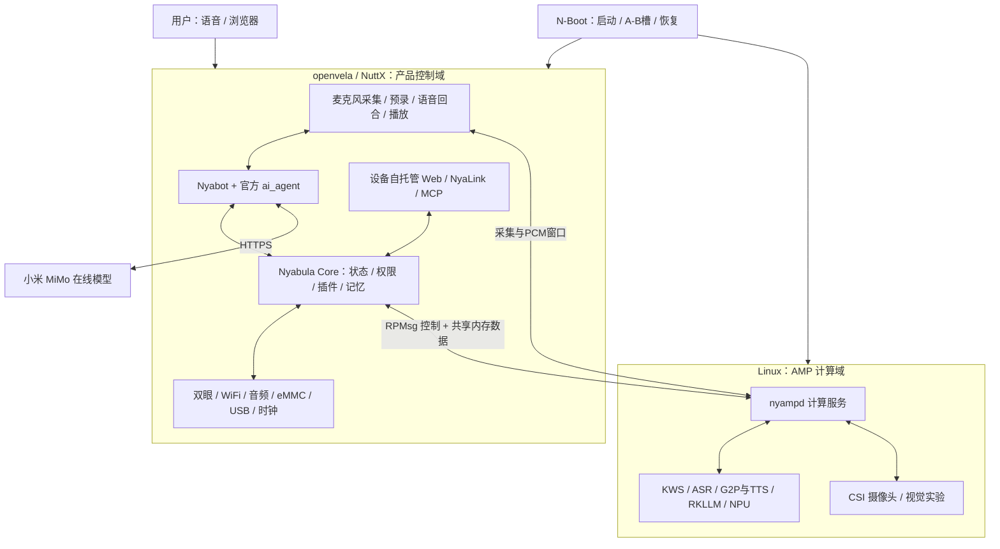

# Nyabula · 星喵

### 基于 openvela 的 RK3576 桌面 AI 陪伴猫

**2026 首届 openvela AI 硬件开发者大赛 · 队伍 062 · Pharos Tech**

参赛方向：**新硬件适配 + AI 硬件产品创新**

Nyabula 是一只用双圆屏表达情绪、能听懂指令并执行设备动作的桌面陪伴猫。我们从 KICKPI-K7 的第一行串口输出开始，把 openvela 移植到 RK3576，逐步完成存储、原生 WiFi/蓝牙、音频、USB、双屏、启动恢复和产品运行时，最终打通 **唤醒 → 语音识别 → Agent → 工具执行或回答 → 语音合成 → 扬声器播报** 的完整交互回合。

设备可以使用 RK3576 NPU 上的本地 MiniCPM5-1B，也已接通小米 MiMo 在线 Agent。**openvela 负责产品状态、权限、工具执行、记忆、联网、存储、双眼和音频；Linux 通过 AMP 提供模型与摄像头计算服务。** 我们同时把开发过程沉淀为 24 份工程 Skill、构建与调试工具、可追溯的 PR 和 AI Coding 日志，希望交付一只可演示的猫，也交付一套其他团队能够继续使用的移植方法。

> **版本口径：2026-09-20，UTC+8。** 本文覆盖团队已完成的主线、产品分支和独立实验成果，并分别标明证据范围。完整语音功能由当日现场验收确认；产品集成在 [PR #93][p93]，尚未合入。24 份工程 Skill、双方 AI 日志与示例清理已分别经 [#95][p95]、[#96][p96]、[#98][p98]、[#97][p97] 合入。本文不是某一个最终镜像的全功能长稳认证。

**快速入口：** [作品亮点](#作品亮点) · [产品体验](#产品体验) · [架构](#系统架构) · [硬件与BSP](#硬件平台与-bsp) · [语音与Agent](#完整语音与双后端-agent) · [实测数据](#实测数据与验证范围) · [构建运行](#获取构建与运行) · [24份Skill](#24-份可复用工程-skill) · [交付状态](#交付状态与下一步)

## 作品亮点

| 亮点 | 我们完成了什么 | 为什么有价值 |
|---|---|---|
| 新 ARM64 平台适配 | 以 RK3399 移植为参考，完成 RK3576 的启动、GICv2、MMU、时钟、SMP/AMP 与外设适配 | 将高性能 Rockchip 平台接入 openvela，留下芯片层、板级层与设备驱动的清晰边界 |
| 原生无线 | SV6621/SWT6621S FullMAC WiFi 和 SDIO 蓝牙 transport；STA、SoftAP、WPA3 等独立板测 | openvela 自己持有无线与网络能力，计算域无需代管 WiFi |
| 完整语音产品链 | 本地唤醒、ASR、Agent、工具执行、TTS 和播报贯通；支持端侧与在线模型后端 | 从“模型能运行”推进到“设备能回应、能做事” |
| 异构协作 | 4×A53 openvela + 4×A72 Linux 拓扑、RPMsg、共享内存、模型按需传递 | 保留 openvela 的产品控制权，同时利用 RK3576 NPU 与 Linux 模型生态 |
| 可维护的设备 | N-Boot、NuttX/AMP 双域 A/B、摘要校验、Fastboot、运行态 nbootctl、面板 OTA | 从拔卡烧写演进为可持续开发、部署与恢复的设备 |
| 双眼与产品运行时 | 双 GC9B72 圆屏、Eye Engine、权限 Broker、JS/Wasm 插件、原生产品服务和自托管面板 | 把表情、状态、工具和交互统一到一个设备运行时 |
| AI 开发方法可复用 | 24 份工程 Skill；源码、反例、验证脚本、来源与边界一起交付 | 将一次比赛中的探索变成下一块板、下一个驱动可复用的工程知识 |

## 产品体验

### 已贯通的交互主线

1. **连接设备。** 通过设备 SoftAP 配网、二维码入口和浏览器控制台完成联网与设置。控制台由设备自身托管，HTTP 与 WebSocket 共享服务端口。
2. **看见反馈。** 双眼显示表情、凝视、眨眼、字幕和状态场景，语音回合中的聆听、处理与播报有对应视觉状态。
3. **自然说话。** 唤醒后采集语音、识别文本，交给同一个 Nyabot/官方 `ai_agent` 工具执行链；回复合成为声音并播放。赛事唤醒词遵循“你好，openvela / Hello, openvela”的要求。
4. **执行真实动作。** 已测的端侧指令包括读取时间、显示开心表情、创建五分钟计时器、设置或相对调整音量、写入长期记忆、建立闹钟与待办。设备状态实际变化，并返回 `sideEffectApplied:true`。
5. **选择模型后端。** 本地 MiniCPM5-1B 负责端侧回答与受约束的设备意图处理；在线 MiMo 已完成 HTTPS 调用和多工具成功回合。两类后端使用产品侧的权限和工具机制。
6. **持续维护。** 面板可管理设置、模型与升级；AMP 运行期间已经实测上传新固件、写非运行 AMP 槽、重启与确认。

以上语音主链、端侧工具动作、在线 Agent、面板和 OTA 各有当日功能验证；没有将其扩张成所有后端、异常、打断和并发组合均已完成测试。

### 使用场景与产品方向

Nyabula 面向桌面工作、学习与日常陪伴：用眼睛提供轻量反馈，用语音完成计时、提醒和设备控制，用可扩展工具连接其他服务。端侧模型为本地交互提供基础，在线模型扩展复杂语言处理能力。插件、MCP 和工程 Skill 则让设备具备继续扩展的空间。

当前定位是具有完整交互主线的工程原型。面向开发者的 openvela/Rockchip 参考平台与可扩展陪伴终端，是两条可继续探索的产品方向；成本、续航、量产结构和商业定价尚未完成验证。

## 系统架构



### 为什么把产品控制放在 openvela

设备的状态、文件、权限与执行结果由 openvela 管理。模型提出回答或动作请求，实际调用仍经过产品工具和审批逻辑；Linux 提供计算结果，不直接接管产品状态数据库。在线模型接通后，同样沿用这一机制。

openvela 提供实际使用的 NuttX 调度、驱动、文件系统、网络、音频、图形与应用能力；项目复用官方 `ai_agent`、LVGL、QuickJS、WAMR 等组件，并补充平台适配与产品集成。AMP 的价值是使用 NPU、语音模型和摄像头生态，同时明确两个系统对 CPU、RAM、中断、时钟及外设的所有权。

协作式 AMP 依赖两个可信系统遵守约定，不构成针对恶意内核的硬件安全隔离；任一 OS 独立重启且不影响另一方，也不在当前已验证范围。

## 硬件平台与 BSP

### 硬件组成

| 部件 | 实际平台及用途 |
|---|---|
| 主控 | KICKPI-K7 / RK3576；4×Cortex-A72 + 4×Cortex-A53，片上 NPU 标称 6 TOPS |
| 中断与启动 | GIC-400 / GICv2；Rockchip DDR/SPL、BL31、OP-TEE 与配套 N-Boot |
| 存储 | 开发阶段 SD；双屏产品转为板载 eMMC，GPT、FAT、独立配置/数据与启动槽 |
| 无线 | SeekWave SWT6621S / SV6621，实测 chip ID 为 SV6160LITE；WiFi/BT combo |
| 双眼 | 两块 GC9B72 圆屏，360×360、RGB565、FSPI/QSPI 与 GPIO TE |
| 板载音频 | SAI + PL330 + ES8388、麦克风、扬声器/耳机路由 |
| USB | DWC3 Device/ADB；xHCI Host、Hub、存储与 USB 声卡 |
| 摄像头 | OV5647，经 Linux 计算域 CSI/D-PHY/CIF 链路采集 |
| 时间与环境 | HYM8563/PCF8563 RTC、SARADC 光感与 TSADC 等外围能力 |

双眼与 SD 使用复用引脚，因此双屏产品使用 eMMC。硬件的标称算力、PHY 协商速率和控制器能力不作为应用性能实测值。

### 从启动到可用平台

最早以 openvela 已有 RK3399 ARM64 移植为参考，通过原厂 DTS、TRM 和串口证据确认 RK3576 的地址、中断及启动契约。完成入口 EL 处理、GICv2、MMU/页表、Cache、PSCI、generic timer、UART，最终在 `0x40200000` 装载地址进入 NSH；随后推进 SMP、时钟树和外围驱动。

芯片与板级实现通过 `ARCH_CHIP_CUSTOM` / `ARCH_BOARD_CUSTOM` 和 manifest linkfile 接入。当前还存在 NuttX、external、ZBlue fork 与产品依赖补丁，因此“早期 BSP 可放在 vendor 侧”不能被理解为整个最终产品完全无需公共层修改。

| 模块 | 具体产出 | 主要评审入口 |
|---|---|---|
| ARM64 启动 | RK3576 chip/board 注册、真实 IRQ 表、计时频率、链接地址、NSH、SMP/AMP 基础 | [#2][p2]、[#4][p4]、[#5][p5]、[#6][p6]、[#84][p84] |
| UART | 早期 putc、DW16550 完整串口与命名/结构整理；调试串口 1500000 8N1 | [#8][p8]、[#20][p20] |
| GPIO/IOMUX | 五 bank、输入输出、中断、状态与公共 API 整理 | [#15][p15]、[#16][p16]、[#65][p65]、[#89][p89] |
| CRU | 时钟框架与树、父源/分频/门控，UART、SAI、总线和 CPU 时钟 | [#29][p29]、[#42][p42]、[#49][p49]、[#52][p52]、[#53][p53]、[#69][p69]、[#82][p82]、[#88][p88] |
| I2C/SPI/PWM/FSPI | I2C 事务、SPI、PWM v4、双屏 QSPI 支持 | [#18][p18]、[#32][p32]、[#33][p33]、[#46][p46]、[#77][p77] |
| DMA | PL330 microcode、传输分配与生命周期、音频 DMA | [#36][p36]、[#45][p45]、[#56][p56] |
| SD/eMMC | DW-MSHC PIO/IDMAC、SDHCI、ADMA2、HS200 tuning、HS400ES、GPT/FAT、热插拔挂载 | [#11][p11]、[#37][p37]、[#51][p51]、[#54][p54]、[#80][p80] |
| 音频 | SAI、ES8388、双麦/立体声、功放与耳机路由、audioctl | [#38][p38]、[#39][p39]、[#56][p56]、[#57][p57]、[#58][p58] |
| USB | DWC3 UDC、ADB、DWC3/xHCI Host、Hub、MSC/exFAT、UAC 接入 | [#30][p30]、[#31][p31]、[#68][p68]、[#90][p90] |
| 基础外设 | RTC、SARADC、TSADC、timer、watchdog | [#63][p63]、[#64][p64]、[#66][p66]、[#73][p73]、[#74][p74] |
| 双屏 | ST77916-family 中的 GC9B72 初始化、LVGL、TE 和双屏流水 | [#59][p59]、[#75][p75] |
| 电源 | RK806 regulator 驱动与部分电源树，仍为开放 PR | [#61][p61] |

各 PR 记录实现和评审范围；不同配置下的板测不能由一张功能表互相替代。分层过程中将通用设备协议与 SoC transport、板级接线分开，使其他板型可以复用驱动核心。

### 存储与持久化

SDMMC 从 PIO 发展到 IDMAC，支撑早期系统启动、FAT `/data` 和串口热更新。eMMC 从 8-bit PIO 推进到 ADMA2、HS200 tuning、HS400 Enhanced Strobe，并加入 DMA-safe bounce，处理未对齐缓冲区回退 PIO 的性能问题。

64 MiB、512 KiB 请求的只读实验中，eMMC 约 **75.5 MiB/s**，同口径 PIO 约 **12.6 MiB/s**。产品阶段完成空盘建盘、九分区布局、独立 `/config`、`/data` 与 A/B 槽，以及空白 data 首启创建文件系统；9 月 20 日记录 `/data` 文件系统容量扩展到约 28 GiB，解决预制小 FAT 镜像容量不足的问题。

## 原生 WiFi 与蓝牙

### 从芯片身份取证到 FullMAC 驱动

早期 DTS 中曾出现 RTL8822CS、AP6256 等标签。团队结合芯片丝印、Android 日志、SDIO VID/PID 与 chip ID，确认真实 combo 为 SWT6621S/SV6621。SiFli 端口的二进制核心库不能直接作为完整 AArch64 实现使用，最终形成独立的 Apache host 驱动，协议层与 RK3576 SDIO transport、板级胶水分离。

CMD5 无响应的突破来自 combo 侧引脚环境与上电期间 SDIO 时钟的组合调整，首次得到 `R4=0x90ffff00`，随后完成枚举和固件协议。我们保留了此前错误判断及被实测推翻的过程；没有逐项二分的组合条件，不被写成已经证明的唯一根因。

### WiFi 已完成的能力

- 固件装载/校准、CMD52/CMD53、IDMAC、命令与事件、Ethernet 数据面、WEXT、统计与异步固件恢复。
- STA、SoftAP、Open/WPA2/WPA3-SAE、PMF、GTK/IGTK 更新及重放保护。
- hidden SSID、国家码、双频扫描、连接态后台扫描、scheduled scan、漫游与回退。
- WPA2/WPA3 SoftAP **20 轮 `OK=20 FAIL=0`**；transition BSS 双 AKM 数据面、真实客户端 rekey、连接态扫描 ping 15/15。
- 指定短稳态中双向 400 包、单向 600 包无丢包，并检查内存变化。

主要源码与实验入口为 [WiFi PR #60][p60]。HE/HT/VHT 协商与 PHY Mbps 不等于应用吞吐；显式 suspend/resume 不等于 WoWLAN magic-packet 深睡唤醒，后者尚未完成。

### 蓝牙 transport 与 profile 实验

在同一 SDIO combo 上完成 BT service 生命周期、BTREADY、NVDS、H4 command/event、ACL/SCO/ISO 映射和无线固件恢复协同，接入 NuttX Bluetooth lower-half，并配套补充 ZBlue/NuttX transport。[蓝牙 PR #67][p67] 与 [NuttX fork][nuttx]、[external fork][external]、[ZBlue fork][zblue] 共同构成依赖链。

独立配置中已记录 BLE 双向 GATT/通知、Classic pairing、安全、RFCOMM/SPP、A2DP Source/Sink 数据、AVRCP，以及 HFP SLC/mSBC/eSCO 部分链路。RFCOMM 有 200×1000-byte 上行压力记录，A2DP Sink 有 312 packets / 2184 SBC frames。

这些是协议与驱动成果。最终 product 当日仍出现 `nybt: bring-up failed: -19`，手机配对、蓝牙音箱和双向电话尚未完成产品验收；HFP 部分 SCO TX、LE Audio 控制面也不等于完整可听音频。我们分别保留独立驱动成功与产品集成缺口。

## 音频、USB 与双眼

### 音频工程

SAI + PL330 + ES8388 已形成录音、播放、同格式全双工、16/24/32 位、单双声道、双麦、输出路由与启停生命周期。[音频 PR #58][p58] 包含 **11 采样率 × 3 位宽 × 单双声道 = 66 项**采集矩阵，各项检测到目标基频，其中两项右路削顶仍需归因；另有 packed-24 的 22 项录放、20 次快进倍率切换、26 轮并发启停等验证。

USB Speaker OUT 在真实声卡上连续播放 **115.44 秒文件两遍**，经现场确认出声和连续性；USB Mic IN 目前只有端点生命周期和宿主边界测试，真实麦克风录音与 UAC 全双工尚待板测。USB3 BOT 指定设备实验峰值约 **36 MiB/s**，不包含 UAS 性能结论。[USB Host #68][p68]、[UAC #90][p90]、[NuttX UAC #10][n10]。

独立 `nyabula_dsp` 探索还形成 LR4 分频、EQ、增益、延迟、极性、限幅及离线 WAV 工具，已做宿主测试；它尚未成为最终产品的实时 DSP 或自动声学校准能力。

### 双圆屏与 Eye Engine

显示链采用 **双 360×360 GC9B72、RGB565、共享 FSPI、GPIO TE、双缓冲与 CPU/DMA 流水**。Display 负责物理屏幕与调度，Eye 负责视觉内容，Core 负责来源、权限与请求生命周期。

Eye 已有 **13 类表情、25 类原有 Scene**，支持左右/双眼眨眼、自动眨眼、凝视、虹膜/异瞳、字幕、来源优先级、lease 和 release；后续增加配网二维码等产品场景，不将不同版本的场景数量混加。

团队通过预烘焙纹理、NEON 染色/抖动、虹膜 SDF 与 TE 调度优化，将指定 1.8 GHz 测试条件下每屏每帧渲染从 **40 ms 降到 4 ms**，满足该场景的单核 60 fps 动画。该结果来自 [#86][p86]，不表示完整语音/模型/网络同时运行时已经持续 60 fps 长稳验证。后续视觉修正见 [#94][p94]。

Core/Eye 还形成特定版本的 47 项测试交付包，包含命令、JSON、镜像及 SHA256SUMS。光感已测到 ADC → 平滑值 → 亮度级别 → dilation 参数链，样例为 raw 571–572、level 0.70、dilation 0.19；自动瞳孔视觉效果的完整目视验收单列。

## N-Boot：启动、升级与恢复

[N-Boot][nboot] 是保留 U-Boot 历史与许可的 K7 下游发行版。我们的工作集中在 RK3576/K7 板级集成、镜像契约、启动策略、A/B、恢复和运行态控制，不将 U-Boot 的既有实现计为从零自研。

### 已建立的维护链路

| 层次 | 产出 |
|---|---|
| 引导适配 | vendor SPL/BL31/OP-TEE 兼容、ARM64 Image 头、板级 DT、串口身份、minimal/full profile |
| 元数据 | CRC 冗余 bootctrl，NuttX 与 AMP 各自的槽状态与选择 |
| 镜像验证 | 加载前 SHA-256、损坏槽同次启动回退、active 持久化、介质辨认 |
| 恢复 | SD/eMMC 选择、Fastboot、校验写槽、一次性启动请求、N-Boot 自更新 |
| 运行态 | `nbootctl` 状态、定向重启、clone、stage、槽/版本操作、交接信息读取 |
| 构建交付 | SD/eMMC 打包、release 拉取与校验、分区合同、SHA256SUMS |
| 最新产品 | AMP handoff domain/slot、运行槽保护、面板写非运行槽、重启与 confirm |

早期 device-model 初始化收敛实验从 **2.891 s 降至 0.277 s**；这是该阶段初始化时间，不是整机开机时间。[N-Boot #6][nb6]、[团队 nbootctl #83][p83]。

已合入的 [N-Boot #8][nb8] 完成 ABI2 FIT 检查与 RAM bootamp；[#9][nb9]、[#10][nb10]、[#11][nb11] 继续承载 AMP A/B、校验写槽、交接头与 eMMC 热重启恢复，本文快照时仍为开放 PR。

### 9 月 20 日的 AMP OTA 闭环

配套 N-Boot 与新 reader 上板后，`nbootctl status` 返回：

```text
medium=emmc domain=amp slot=b generation=132 reason=normal
```

面板能区分 NuttX/AMP 槽并保护当前运行槽；`confirm amp` 成功，错误目标 NuttX 被拒。随后两次在 AMP 运行期间上传 **40,392,704 / 40,400,896 bytes** 镜像，写入非运行 AMP 槽，重启进入新槽。原“AMP 内缺少交接信息而不能完成面板升级”的阶段性限制已关闭。

eMMC 无应答恢复实现只对 EIO 重试，启动共享五次预算、200 ms 至 3.2 s 退避，第三次起本次启动降至 52 MHz；空槽、外来分区和摘要错误不作临时错误反复尝试。连续六次热重启全部返回 AMP，但当时串口不可用，无法确认重试分支实际触发次数，热态相位/卡复位的最终根因尚未确定。

槽校验回退不等于已启动 OS 挂死后的自动回滚；N-Boot 原位自更新也不承诺断电原子性。普通 NuttX 和 AMP 镜像的入口、槽与交接必须配套，不能混装。相关操作已沉淀为 [nboot-control][s-nboot-control]。

## AMP 与模型交付

### 双系统真正同时运行

已验证拓扑为四 A53 运行 openvela、四 A72 运行 Linux，mailbox/RPTUN/OpenAMP/RPMsg 构成控制链。openvela 的 `nyampctl` 和 Core 请求 Linux `nyampd` 服务。早期最小 AMP 验证与后来的完整 product 属于不同配置，具体核数和启用项以对应镜像 `.config` 为准。

产品集成把 eMMC、WiFi、双眼与音频留在 openvela；Linux 禁用冲突控制器，保留计算与摄像头所需资源。AMP openvela 镜像使用 `0x4a400000` 的 16 MiB 契约区，产品大堆可放入 `0x70000000` 额外 256 MiB Linux no-map 区；共享 GIC 的 SPI 路由采用对应静态分配。

RPC 实现包含 wire ABI、generation、request ID、deadline、sequence、取消、背压、终止事件和共享窗口 lease。控制消息走 RPMsg，大数据走共享内存；各服务分别记录宿主和板上验证范围。[AMP 基础 #84][p84]、[计算服务 #87][p87]、[产品集成 #93][p93]。

### 模型与固件独立管理

模型保存在 openvela 的 `/data/models`。Linux 按逻辑名称请求 BLOB，经共享内存拉入 tmpfs 后加载 RKLLM，无需取得 eMMC 文件系统控制权，也无需把近 GB 模型塞进约 40 MB 固件。

实测 4 MiB 共享区双向校验 **1,048,572 words 一致**。875,760,324-byte 模型的传输段约 **44 MiB/s**，首次包含完整摘要的端到端流程 **82.839 s**，缓存复用 **7 ms**；这些指标对应不同阶段。之后使用摘要缓存的冷首句约 28–32 s，也不能与完整初次校验流程混用。

资源工具支持来源/版本/兼容性/哈希清单、模型与 runtime 分包、确定性归档以及独立验证。已知历史模型 hash 不等于源 revision 与分发许可已全部补齐，具体以 [资源与分发约定][product-resources] 为准。

## 完整语音与双后端 Agent

### 语音链

**完整“唤醒 → ASR → Agent → TTS → 播放”回合已于 9 月 20 日由项目现场验收确认跑通。** 早期文件 ASR、固定音素 TTS 和宿主协议测试是里程碑，已不再代表当前整机功能上限。

openvela 的 `ny_voice_capture/pump/sm/play/eyes` 管理麦克风、预录、流传输、回合状态、扬声器与表情；Linux 的 `nyampd_asr/tts/kws` 提供模型服务。16 kHz S16 音频进入预录环，KWS 命中后 ASR 从对应采样偏移接入；识别文本交给 Nyabot，回复经 G2P 分句、TTS 和 PCM 窗口回到设备播放。

最后一轮关键修复针对“唤醒后缩回、没有进入处理”：能量门限曾将唤醒词尾音误作有效发言，短静音后以空文本提前结束。改成“识别器产出文字后才按说话结束判断；空文本忽略提前 endpoint，保留五秒无文字收尾”，完成构建、OTA 和现场复测。

组件实测包括 TTS 样句 **60,928 samples / 1.38 s 音频，计算 1,117 ms、首窗 1,105 ms**；模型冷加载另计 24,869 ms。直接播放样例经现场确认听到声音，40 字带标点长句从 speaking 返回 idle。六秒无人说话采集的空 ASR 文本，仅证明该次采集与处理成功，不作识别准确率。

语音宿主验证包含 DSP/状态机 **4,103 checks**（普通及 ASan/UBSan 分别通过）、真实 C wire 客户端 **235 checks**、55 个 TTS 窗口/1,982,464 samples，以及 10 文件×3 codec 模式×2组选项交叉语法检查。这些为实现提供证据，不替代物理麦克风与整机测试。

当前默认 `CODEC_HALF` 在说话期间闭麦；ES8388 并发录放要求格式相同。SHARED_16K/44K 是其他配置选项，不能因此宣称全双工插话或 AEC 已完成。真人唤醒率、误唤醒、远场噪声、整回合延迟分布和长稳仍需量化。

### 端侧 MiniCPM5 与可信设备动作

MiniCPM5-1B W4A16 通过 RKLLM 1.3 在 RK3576 NPU 上运行，已完成中文回答、工具格式探针、调频/前缀复用、跨域 LLM RPC 和产品后端集成。

另一个独立产出是 [纯 C++17 模型前端][product-chat]：byte-level BPE 分词、Unicode 分类表、chat template、流式 UTF-8 解码、工具调用解析与 OpenAI 形状响应。它绕过 RKLLM 内置 prompt 路径的乱码/工具格式不兼容，板上不需要 Python；已有 293 golden 与 30,293 fuzz 的逐 token 参考对照，适用指定模型。

实测发现 1B 模型面对完整多工具表时会描述动作却不调用。产品采用可验证的组合：明确操作先由规则识别；必要时交给模型做单工具补参；仍由官方 Agent 与产品权限执行；结果使用事实模板呈现；普通聊天单独走模型。

已执行时间、表情、计时器、绝对/相对音量、长期记忆、闹钟和待办。“你觉得计时器这个发明怎么样”作为不应执行的聊天反例保留。后续修正“看月亮”被误判远期日期、历史闹钟叙述误触发及“音量增加10”误作绝对值等规则问题；它们是针对性回归，不等于任意复杂自然语言任务的正确率保证。

端侧短请求约 **25–26 tok/s**、prefill 约 **3.8 ms/token**；另一产品请求约 21.4 tok/s，受上下文影响。满 run 记录触发 EQUOTA 后，加入淘汰最旧已结束 run 的策略，恢复连续对话。

### 在线 MiMo Agent

在线后端为小米 MiMo `mimo-v2.5-pro`，由 openvela 官方 `ai_agent` 发起 HTTPS 请求，工具权限和状态仍在本地。部署 CA 根证书后完成 TLSv1.2 握手；修复 chunked 响应完整后仍等待 keep-alive 连接关闭的问题，单轮样例约九秒，多工具两例分别 **14 s / 27 s succeeded**。

仍有通用工具表下参数猜测、日期表达与 Markdown 输出等质量问题，因此这里确认的是在线后端与成功工具回合，而非全工具正确率或网络 SLA。在线模型接入与下文独立 Nyabula Cloud 中继是不同能力。

### 时间与产品一致性

SNTP、RTC 回写和开机读取已上板验证。样例与 PC UTC 差小于一秒；重启先读 RTC，随后网络校正，记录过 `+0.590 s`、RTT 70 ms。早期固件停在 2021 年的时间问题不再作为当前状态。准确时间也为闹钟、Agent 时间回答与日志提供基础，长期 RTC 漂移尚未量测。

## Nyabula Core、插件与产品服务

### 插件运行时

Core 集成 QuickJS/WAMR，提供模块/provider、Permission Broker、权限数据库、Ed25519 签名、签名者/版本撤销、`.nya` 确定性打包、版本槽、current/last-known-good 晋级恢复、SQLite 事务、配额、后台调度、取消与异步完成队列。

TypeScript、C、Rust、TinyGo SDK 已有构建/运行记录；真实 K7 AMP 上运行过签名 JS/Wasm，十轮短测无净内存增长。目标是受管理的可信本地插件；共享地址空间与内核的条件下，不宣称可安全执行任意恶意插件的强沙箱。

插件可经同一权限接口提交 Eye 表情、眨眼、凝视和字幕，来源取自插件身份，来源只能释放自己的请求；队列、JSON 大小、嵌套与数字边界均有限制。命令入队、渲染线程应用和物理屏幕扫描是不同阶段。[Core/Eye #85][p85]、[Core 说明][core-readme]。

### 原生产品服务

| 服务组 | 已实现内容 | 验证口径 |
|---|---|---|
| 状态与持久化 | CAS revision、SQLite、设置、记录、记忆、重启恢复 | sim/宿主回归，部分真机持久化与工具动作 |
| 时间管理 | 倒计时、秒表、闹钟、待办、SNTP/RTC | 工具动作与时钟已有板测；全异常组合未穷尽 |
| 设备与交互 | Eye、音量、媒体、通知去重、语音回合、光感参数 | 产品主线功能板测；媒体/蓝牙并发仍需验收 |
| 信息与陪伴 | QWeather 配置/轮询、简报、默认关闭的主动陪伴 | 已有实现与软件验证，非全部真实服务账号验收 |
| Agent | 官方 ai_agent 适配、Nyabot、规则与本地模型、在线模型、技能管理 | 已有端侧动作与在线成功回合 |
| 连接 | Web 管理、认证 WebSocket/NyaLink、渠道、Node、双向 MCP | 面板上板；其他按各自 sim/宿主证据判断 |
| 运维 | 模型交付、升级、状态检查、槽确认 | 普通 product 与新配套 AMP OTA 已测 |

原生服务以 [#91][p91] 为阶段性入口，完整产品集成集中在 [#93][p93]；重叠内容不重复统计成多份独立成果。

### MCP 与可扩展连接

MCP 支持外连管理、工具目录与逐次审批；入站方向有独立凭据/scope、principal 隔离、权限撤销和会话取消等实现与软件验证。服务和渠道适配存在，不等于真实微信、飞书等外部账号已经生产联调。

设备运行时 Skill 基于官方 `ai_agent` 的 loader 与管理能力，有自定义保存/启用/读取证据；官方内置技能不算团队原创。运行时技能与开发阶段的 24 份工程 Skill 分别统计。

## 摄像头、视觉与多模型实验

| 方向 | 独立成果 | 验证边界 |
|---|---|---|
| OV5647 | 芯片 ID、驱动回调、crop、D-PHY、连续 RAW、AWB 设置；1080P 900 帧约 30.592 fps、0 跳号 | Linux 计算域原始采集；PC 去马赛克/gamma/H.264 不计板上 ISP/编码 |
| SFace | FP16 RKNN 转换、预处理修正、重复归一化错误定位、30 次板上特征对照 | 已对齐人脸特征步骤，不含完整检测、认主或活体 |
| SFace 数值/速度 | 27 次暖运行均值 13.401 ms；相对 ONNX 最低余弦 0.999977668 | 数值一致性样例，不是识别准确率 |
| 三模型同驻 | ASR、Melo、MiniCPM5 同驻与并发，两轮请求/资源采样 | 独立实验镜像，不直接代表最终 product |
| 资源测量 | 稳态三模型 PSS 约 708 MiB；初始化 MemAvailable 低点约 2.007 GiB | PSS 不含全部 NPU/驱动内存；无整机功耗结论 |

这些实验帮助决定计算卸载、模型交付与调度方式。完整主人注册、陌生人拒识、声纹、活体、rPPG/健康判断、持续视觉主动陪护仍属待集成或研究方向。

## 多端、云与其他探索成果

以下资产来自项目开发工作区，部分尚未进入团队主线；它们是单独的原型与实验，不自动计入当前板端产品完成度。

| 资产 | 实际产出 | 当前范围 |
|---|---|---|
| Vue WebUI | 共享 UI/协议、桌面/平板/手机布局、主题、Logo、加载与导航、功能卡片、真实 Core 联测 | 最新产品面板已由板端托管；历史原型与最终面板分版本 |
| Flutter Client | Windows/Web/Android/iOS 工程，analyze、42 tests、Windows build 记录 | 不等于四平台均完成发行与真机验收 |
| NyaLink / NyaUI | Go/TypeScript/Flutter 适配，22 组件树与 patch DSL，PC 冒烟 7/7 | 协议与多端原型成果 |
| Go Cloud / Simulator | Go+SQLite、账号、设备认领、出站连接、sid 多路中继、统计，PC E2E 10/10 | 真实服务配模拟设备；板端公网 Cloud 闭环未确认 |
| 虚拟猫舍 | Three.js/Vue、猫动作、昼夜光照、物理、合批、性能 HUD；约 5k triangles，draw calls 172→114 | 浏览器实验，不是板上 GPU/VR 渲染成果 |
| 机械与外观 | OBJ/MTL/ZPR、猫身体与后盖 STL、3 mm 抽壳、剖面检查与几何记录 | 模型资产不等于打印装配、跌落/散热/续航或量产验证 |
| 品牌 | Nyabula Logo、SVG、favicon、预览与编辑页 | 视觉识别资产 |
| 音乐探索 | MIDI、对比页、播放器与试听包 | 历史内容实验；不纳入 24 份工程 Skill，第三方参考不计原创 |

可拆头显、磁吸底座与完整运动机构保留为产品设想。本次已确认的价值集中在平台、双眼、语音、Agent 和设备维护，不以尚未实现的概念充当演示功能。

## 实测数据与验证范围

下面按实验列出可核查数值。**不同版本、输入、设备与测试窗口不能拼成一个从未运行过的“最终整机性能”。** 详细依据位于对应 PR、Skill references、测试工具与项目实测记录。

| 项目 | 结果 | 口径 / 来源 |
|---|---|---|
| eMMC | 75.5 MiB/s；PIO 对照 12.6 MiB/s | 64 MiB、512 KiB 请求、只读；[#54][p54] |
| USB3 BOT | 峰值约 36 MiB/s | 指定 ASMedia/Hub，不含 UAS；[#68][p68] |
| WiFi SoftAP | 20/20 通过 | WPA2/WPA3 控制与数据面；[#60][p60] |
| WiFi 短稳态 | 双向 400 包、单向 600 包，0% 丢包 | 约十分钟窗口；[#60][p60] |
| Codec 采集 | 66 项检测到目标基频 | 两项右路削顶保留；[#58][p58] |
| 音频短稳态 | 26 轮、301.438 s，堆指标前后相同 | R17 指定版本；[#58][p58] |
| USB Speaker | 115.44 s 完整文件播放两遍 | 真实出声；不含 Mic IN；[NuttX #10][n10] |
| Eye | 每屏每帧 40→4 ms | 1.8 GHz 指定渲染条件；[#86][p86] |
| N-Boot | 早期初始化 2.891→0.277 s | 不等于总开机时间；[N-Boot #6][nb6] |
| Camera RAW | 1920×1080、900 帧、30.592 fps、0 跳号 | 独立媒体 R005/R010，Linux RAW |
| SFace | 暖运行均值 13.401 ms；余弦最低 0.999977668 | R019 已对齐特征，不是整套认主 |
| 三模型 | PSS 约 708 MiB；MemAvailable 低点约 2.007 GiB | R038/R039，不是最终固件总内存 |
| 共享内存 | 1,048,572 words 一致 | 4 MiB 双向自检；[#93][p93] |
| 模型搬运 | 44 MiB/s；首次 82.839 s；复用 7 ms | 传输、全流程、缓存三种口径；[#93][p93] |
| 本地 LLM | 短请求约 25–26 tok/s；prefill 约 3.8 ms/token | 指定请求/上下文；[#93][p93] |
| 端侧 Agent | 冷首句约 32 s succeeded | 包含搬模型、加载与回答；[#93][p93] |
| TTS | 1.38 s 音频 / 1,117 ms 计算，首窗 1,105 ms | 冷加载另计 24,869 ms；9/20 板测 |
| 在线 Agent | 多工具两例 14 s / 27 s succeeded | 指定网络/指令；9/20 板测 |
| 语音整回合 | 完整功能链跑通 | 9/20 现场确认，无逐回合延迟统计 |
| 时间同步 | 与 PC UTC 差 <1 s | 一次校正 +0.590 s、RTT 70 ms，非长期漂移 |
| AMP OTA | 两次约 40 MB 镜像写非运行槽并重启 | 配套新 N-Boot/reader；非断电故障注入 |
| 热重启 | 6/6 回 AMP | 未观测重试是否触发；[N-Boot #11][nb11] |
| 面板短测 | 30/30 突发、4×20 并发、90 s 浸泡 | 指定版本，非长期稳定性；[#93][p93] |
| 语音宿主 | 4,103 状态/DSP checks；235 wire checks | 普通/消毒器与真实 C 客户端；非板测 |
| Skill | 24 份、107 相对链接、RK 18 项回归 | 结构、引用与宿主验证；[#95][p95] |
| AI 日志 | BeaconCat 11 会话、11,848 标准事件，ALL OK | 有继承重叠；[#98][p98] |

## 24 份可复用工程 Skill

比赛成果不止固件。团队把“如何查证、如何实现、如何判断失败、怎样验收”整理为 **24 份独立工程 Skill**，已通过 [#95][p95] 进入主线：[完整目录][skills]。每份以 `SKILL.md` 为入口，按需读取 references/scripts，保留版本来源、成功案例、反例和验证边界。

| 方向 | Skill | 可复用任务 |
|---|---|---|
| 平台 | [rockchip-openvela-porting][s-rockchip-openvela-porting] | Rockchip ARM64 → openvela、启动契约、串口/GIC/MMU、NSH 验收 |
| 启动 | [nboot-control][s-nboot-control] | N-Boot、A/B、介质辨认、镜像制作、运行态控制与恢复 |
| 时钟 | [rockchip-clock-pinctrl-debug][s-rockchip-clock-pinctrl-debug] | 时钟/门控/复位/电源域/pinmux，冷热状态差异 |
| DMA | [arm64-dma-debug][s-arm64-dma-debug] | 缓存一致性、地址、对齐、停止回收竞态 |
| Combo | [combo-sdio-bringup][s-combo-sdio-bringup] | CMD5、上电窗口、SDIO 枚举与固件 ready |
| WiFi | [fullmac-wifi-porting][s-fullmac-wifi-porting] | FullMAC 命令事件、数据面、安全握手与恢复 |
| 蓝牙 | [nuttx-bluetooth-hci-porting][s-nuttx-bluetooth-hci-porting] | HCI transport、生命周期与逐层 profile 验证 |
| 存储 | [sdhci-emmc-bringup][s-sdhci-emmc-bringup] | PIO→ADMA2→HS200/HS400ES，性能与错误恢复 |
| 音频 | [nuttx-codec-audio-bringup][s-nuttx-codec-audio-bringup] | I2S/DMA/codec、格式、路由与录放生命周期 |
| USB | [nuttx-usb-host-porting][s-nuttx-usb-host-porting] | DWC3/xHCI、PHY/VBUS、Hub、ring/context、MSC |
| UAC | [nuttx-usb-audio-porting][s-nuttx-usb-audio-porting] | UAC1/2、等时包、反馈、音量、IN/OUT 分别验收 |
| 显示 | [dual-lcd-te-pipeline][s-dual-lcd-te-pipeline] | 双屏 TE、缓冲所有权、端序与 LVGL 线程 |
| 采集 | [rockchip-csi-camera-bringup][s-rockchip-csi-camera-bringup] | sensor/DPHY/CIF、crop、RAW 连续采集 |
| AMP | [arm64-linux-nuttx-amp][s-arm64-linux-nuttx-amp] | CPU/RAM/GIC/时钟所有权和双 OS 首次握手 |
| RPC | [amp-shared-memory-rpc][s-amp-shared-memory-rpc] | wire ABI、generation、lease、取消与背压 |
| 交付 | [embedded-model-delivery][s-embedded-model-delivery] | 模型/runtime/固件分离、来源与哈希、跨域缓存 |
| LLM | [rkllm-model-adaptation][s-rkllm-model-adaptation] | tokenizer、chat template、乱码、工具输出与性能 |
| RKNN | [rknn-model-conversion-validation][s-rknn-model-conversion-validation] | 预处理、布局、动态长度、FP16/量化数值对照 |
| 测量 | [edge-ai-concurrency-benchmark][s-edge-ai-concurrency-benchmark] | 冷/热/并发、PSS、RTF、可用内存与时延口径 |
| Agent | [small-model-device-agent][s-small-model-device-agent] | 规则/单工具补参、审批与事实结果呈现 |
| 插件 | [nuttx-plugin-runtime-integration][s-nuttx-plugin-runtime-integration] | QuickJS/WAMR、Broker、签名、异步与版本槽 |
| 面板 | [embedded-local-control-panel][s-embedded-local-control-panel] | SoftAP、QR、HTTP/WebSocket、认证与持久化 |
| MCP | [embedded-mcp-integration][s-embedded-mcp-integration] | 工具发现、scope、逐次审批、取消与会话隔离 |
| 复现 | [openvela-release-reproduction][s-openvela-release-reproduction] | 多仓版本、补丁、生成资源、外部输入与镜像身份 |

已检查 24 份结构、107 个包内相对链接、57 处新增源码引用；RK 证据解析器 18 项回归、N-Boot 自测/help、总包独立解压和单项逐文件核对通过。总包与 24 个单项包已形成；这些结果不等于重新执行了 24 类完整硬件任务，也不代表跨 SoC 参数可以照搬。

工程 Skill、设备运行时 Skill、官方工具和个人通用 Skill 分别统计。音乐不在这 24 份集合内。晚间语音/OTA 进展也不会自动生成额外 Skill 数量，具体参考资料仍以各包版本为准。

## AI Coding 与工程方法

### AI 参与了什么

| 环节 | 实际工作方式 | 人与验证的作用 |
|---|---|---|
| 调研 | DTS/TRM 对照、源码定位、模型/协议/许可路线比较 | 人决定范围，原始资料与硬件证据校正推断 |
| 实现 | 芯片驱动、协议适配、构建工具、Core、UI、AMP、AI 服务 | PR review、单职责提交、模块命名与分层约束 |
| 调试 | 构建机、串口、ADB、OTA、日志分析、矩阵与故障复现 | 板上结果和现场听音/目视反馈作为验收依据 |
| 纠错 | 芯片误判、CMD5 假设、格式/时序/资源泄漏、模型工具失效 | 保留失败原文，更新结论，不用新文档抹掉历史 |
| 沉淀 | Skill、脚本、交接、证据索引与 AI 日志 | 明确版本、可复制步骤、验证等级和许可来源 |

项目使用 Codex、Claude Code 等 AI 编码工具，并复用 openvela 官方开发生态。没有可信计量支持时，不报告“100% AI 代码”、累计 Token 总量或节省工时百分比。团队共同完成的时钟、GPIO、显示、驱动、产品和评审成果按 Git/PR 署名保留，不归为单一成员贡献。

### 实测记录原则

全过程维护“场景、可复制操作、原始结果、结论、置信度”的实测记录。置信分为 **实测确认 / 编译通过 / 仅推断**，宿主、sim、编译和物理板测进一步在文字中注明。错误日志、旧判断和失败用例保留，使下一次移植能够复用判断方法。

例如：修正 WiFi 芯片身份；承认 CMD5 组合实验没有逐条件归因；把 A2DP 收包与可听播放区分；将数值余弦与人脸准确率区分；把单模型峰值与整机并发区分；把启动器初始化与整机启动时间区分。它们共同构成这批 Skill 的工程价值。

### 已提交的 AI 日志

[日志目录][logs] 已收录双方贡献：队友日志经 [#96][p96] 合入；BeaconCat 经 [#98][p98] 提交 **7 个 Codex 任务 + 4 个 Claude Code 开发会话，共 11,848 标准事件**，官方校验 `ALL OK`，Git blob 与发布摘要一致。

- Codex：10,073 条用户/助手文本，来源为明确选定的 24 段历史 rollout。工具/附件补充保留本地，未混入本批标准日志。
- Claude：1,775 条事件，其中 573 次工具调用和 573 次返回；其中一个会话继承另一个会话前 302 条，已披露重叠，不重复算独立贡献。
- 发布副本额外遮蔽 59 处设备口令，保留原导出、来源 hash、发布 hash 和方法说明；不修改事实、时间、顺序与事件数量。
- Codex 非 `.repo` 工作区的定向补导方法与局限已写明，格式通过不等于赛事自动认可该归集方式。本批不是全部研发会话的全集，也不用于直接累加 Token。

具体来源与校验说明见 [BeaconCat 日志说明][beacon-logs]。

## 仓库、目录与贡献归属

| 仓库 | 职责 |
|---|---|
| [open-vela/contest2026_062_PharosTech][team] | 正式参赛仓：manifest、芯片/板级、设备驱动、应用、工具、Skill 与日志 |
| [BeaconCat/contest2026_062_PharosTech][fork] | 同一成果链的开发 fork，包含产品分支；不重复计为另一份作品 |
| [BeaconCat/N-Boot][nboot] | U-Boot 下游启动与恢复发行版 |
| [BeaconCat/nuttx][nuttx] | 通用存储、音频、H4、xHCI/UAC 等依赖扩展与修复 |
| [BeaconCat/external][external] / [external_zblue][zblue] | Bluetooth H4 与 ZBlue 构建/transport 接入 |

fork 中合入不代表 open-vela/nuttx 或 Apache NuttX 上游已接收；xHCI 的部分基础移植保留 Apache NuttX 原作者，ZBlue profile 框架、官方 ai_agent 和第三方模型也按原项目归属。SeekWave 私有固件输入不属于自研公开协议代码。

```text
chips/rk3576/                       芯片层：启动、时钟、GPIO、DMA、存储、USB、音频等
boards/rk3576/kickpi-k7/             板级初始化、接线/配置、N-Boot 资产
drivers/                           可复用设备驱动：SV6621、LCD、RTC 等
configs/                           dev / display / core_eye；product 在 PR93
app/nyabula_core/                   Core、插件与产品服务
app/nyabula/                        Eye Engine
app/nyabula_display/                双屏 Display
app/nyampctl/                       openvela 计算服务客户端
app/k7flash/ app/nbootctl/           更新与运行态启动控制
app/audioctl/                       音频路由与控制
tools/amp/                         Linux 服务、协议、模型前端、资源和 FIT 工具
tools/k7_pack/ tools/k7_abpack/      SD/eMMC 镜像、分区与 bootctrl
tools/k7_ota/                       PC 串口更新工具
tools/nyabula_plugin/               插件签名/打包与 SDK 工具
skills/                            24 份工程 Skill
logs/                              AI Coding 日志、manifest 与来源说明
patches/                           产品公共层依赖补丁（PR93）
```

团队 manifest 将 chips/boards/app 通过 linkfile 接入完整 openvela 工程；NuttX/external/ZBlue 依赖指向配套 fork。独立克隆本仓不足以构建整个系统。

## 获取、构建与运行

### 1. 获取完整工程

在 Linux 构建环境安装 Git、Google `repo` 与对应 openvela 构建依赖。使用完整 manifest 获取多仓，保留符号链接：

```sh
mkdir nyabula-openvela
cd nyabula-openvela
repo init -u https://github.com/open-vela/contest2026_062_PharosTech \
  -b dev-ai-contest-2026 -m contest2026_062_PharosTech.xml
repo sync -c -j4
```

完成取源后，从该工作区根目录构建。不要用单仓 clone 代替 `repo sync`。本文说明针对仓库工程，团队内部构建机地址/凭据不属于复现依赖。

### 2. 从适合的配置开始

| 配置 | 用途 |
|---|---|
| `boards/rk3576/kickpi-k7/configs/nsh` | 基础 BSP / NSH |
| `configs/dev` | 无线、音频、USB 等开发验证 |
| `configs/display` | 双屏显示验证 |
| `configs/core_eye` | Core 与 Eye/Display 集成 |
| `boards/rk3576/kickpi-k7/configs/amp` | 最小双域集成验证，需 GIC 依赖补丁 |
| `configs/product` | 产品整合，当前在 PR93，含额外依赖与生成步骤 |

例如在工作区根目录构建基础 BSP：

```sh
./build.sh contest2026_062_PharosTech/boards/rk3576/kickpi-k7/configs/nsh -j4
```

构建 Core/Eye 前生成字体；下载项沿用资源自身许可：

```sh
python3 contest2026_062_PharosTech/app/nyabula/tools/generate_fonts.py --download-fallback
./build.sh contest2026_062_PharosTech/configs/core_eye -j4
```

最小 AMP 在独立、版本匹配的构建工作区应用其 GIC 补丁，再构建：

```sh
bash contest2026_062_PharosTech/tools/amp/nuttx/apply.sh nuttx
./build.sh contest2026_062_PharosTech/boards/rk3576/kickpi-k7/configs/amp -j4
```

Make 与 CMake 的配置入口、生成字体和符号链接要求见 [配置说明][configs]、[Core 说明][core-readme] 与 [AMP 说明][amp-readme]。后两者包含历史阶段说明，当前能力以本文日期和相应 PR/镜像为准。

### 3. 产品分支的复现状态

当前产品源码入口为 [PR93 固定 head][product-tree]：`4c5a3ef479bc911f9ba2bad32f1b616a876b7630`。它包含 `configs/product`、产品服务、语音、模型、面板和公共层补丁。该 head 的 12 个 CheckRun 中 11 个成功，`Build (configs/product)` 停在 **Apply dependency patches**，尚未完成该公开版本的干净构建。

因此，主线取源与上面的基础配置可用于平台复现；完整产品仍需配套 PR93 的依赖修复、Linux/kernel/runtime、生成资源、实际无线固件和 N-Boot 版本。现有板上成功不能替代这一公开源码复现缺口。不要只执行一条 product 构建命令就假定获得了现场全部能力，也不要把工作区中的未提交修改当成固定 head 的一部分。

冻结交付时需同时记录 `repo manifest -r`、依赖补丁、`.config`、模型/runtime 清单、N-Boot 版本和各镜像 SHA256；具体方法见 [openvela-release-reproduction][s-openvela-release-reproduction]。

### 4. 镜像与首次安装

普通 NuttX 的 SD/eMMC 打包入口为 [tools/k7_pack][pack]，输入包括 `nuttx.bin`、仓库配套 N-Boot 资产和固定版本 rkbin。下面命令在团队仓的 `tools/k7_pack` 目录运行，输出普通 NuttX 包：

```sh
cd contest2026_062_PharosTech/tools/k7_pack
./fetch_rkbin.sh rkbin
./build_sd.sh ../../../nuttx/nuttx.bin ../../boards/rk3576/kickpi-k7/nboot rkbin out-sd
./build_emmc.sh ../../../nuttx/nuttx.bin ../../boards/rk3576/kickpi-k7/nboot rkbin out-emmc
```

SD 包提供整盘镜像；eMMC 包包含 Loader、parameter、启动/槽镜像和 SHA256SUMS，由 RKDevTool 按包内说明安装。AMP FIT 需使用匹配的 Linux Image、DTB、initramfs、openvela 二进制与展开配置，构建入口见 [AMP 工具][amp-readme]。普通 NuttX 与 AMP 的槽和入口不同，不交叉写入。

打包工具本身不证明“最新完整产品线刷包”已发布。以实际交付包的版本清单、README 和摘要为准；公共 CI 使用零占位 SeekWave 固件验证构建，运行时会禁用无线，不能将其当成联网演示镜像。

### 5. 运行与验收入口

基础固件通过串口 **1500000 8N1** 进入 NSH。Core/Eye 配置可按 [Core 说明][core-readme] 启动 `nyabula_eye`，通过 `nycore eye-status` 查看；不要同时运行独立 Display demo。

产品镜像使用自托管面板完成配网、设置、Agent、模型和升级。模型目录、CA 证书、在线凭据与插件 trust store 由实际部署提供，仓库不携带用户密钥。最小检查顺序如下：

| 检查 | 观察点 |
|---|---|
| 启动身份 | `nbootctl status` 的 medium/domain/slot 与交付包一致 |
| 双域服务 | `nyampctl health` / `nyampctl info`；能力随版本核对 |
| 存储与联网 | `/data` 可持久化，配网/面板登录正常 |
| 时间 | `system.time.get` 显示有效时间，联网后 SNTP 同步 |
| 设备动作 | 文本指令改变表情、音量或计时器，核对真实状态 |
| 语音 | 实际说话并观察识别文本、回合状态和扬声器输出 |
| 升级 | 核对运行域/槽，面板写非运行槽，重启后检查与确认 |

早期 `k7flash`/Ymodem 串口热刷工具保留用于对应历史布局；当前双域产品以配套 N-Boot、nbootctl 和面板流程为准，不将旧版固定扇区热刷命令照搬到新布局。

## 发展过程

| 阶段 | 主要解决的问题 | 形成的成果 |
|---|---|---|
| 立项与选型 | 性能、资料和生态取舍 | RK3576 平台选择、架构与硬件研究 |
| 6 月末—7 月初 | 从工程构建到第一行 NSH | repo 环境、RK3576 BSP、启动与中断/内存契约 |
| 7 月上中旬 | 调试效率与基础外设 | SD/FAT、k7flash、GPIO/I2C、DMA/SAI/codec、ADB/eMMC |
| 7—8 月 | 无线可用性与性能 | 芯片取证、原生 FullMAC、蓝牙 transport、扫描/安全/恢复 |
| 8 月 | 从能跑转向可维护 | 时钟树、驱动分层、HS400ES、音频矩阵、CI、Core 与多端协议 |
| 8 月末—9 月上旬 | 启动恢复与交互 | N-Boot、A/B、nbootctl、双屏/Eye、四加四 AMP |
| 9 月 12—16 日 | 模型与感知证据 | RKLLM、ASR/TTS、多模型同驻、相机、人脸特征、MCP 与 Skill |
| 9 月 18—20 日 | 产品整合 | eMMC 建盘、配网/面板、模型交付、本机工具动作 |
| 9 月 20 日晚 | 闭合体验与维护 | 完整语音、在线 MiMo、AMP OTA、SNTP/RTC、工程 Skill 与日志归集 |

## 交付状态与下一步

### 当前可审阅成果

| 交付 | 当前状态与入口 |
|---|---|
| BSP、原生无线、音频/USB/双屏、Core/Eye、最小 AMP | 主要能力已合入团队主线，见各模块 PR |
| 完整产品 | [#93][p93] 开放，包含/整合 [#91][p91]、[#87][p87] 的主要产品内容；固定 head 的 product CI 尚有依赖准备阻点 |
| N-Boot | 既有主线与 release；最新 AMP 维护依赖 [#9][nb9]、[#10][nb10]、[#11][nb11] |
| 24 份工程 Skill | [#95][p95] 已合入，源码在 [skills][skills] |
| AI 日志 | [#96][p96]、[#98][p98] 已合入，示例经 [#97][p97] 清理 |
| 作品说明 | 本 README 汇总现有成果、口径、复现入口与边界 |
| 本地交付资产 | Core/Eye 测试包、Skill 总包/单项包、模型与媒体实验、机械/品牌资产、实测与交接记录 |
| 正式提交附件 | 最新完整镜像冻结、完整技术报告、≤5 分钟演示视频、最终照片/BOM/接线仍需按最终提交清单核验 |

### 剩余工作

1. 固定最终源码/依赖/镜像身份，解决公开 product head 的干净构建阻点，归集对应 N-Boot、模型与运行库版本。
2. 对完整语音测量回合延迟分布、真人唤醒/误唤醒、远场与噪声、长句/打断/媒体仲裁、连续运行和功耗。
3. 完成最终 product 的蓝牙 bring-up、手机音箱/电话路径；独立 profile 成功不能代替产品验收。
4. 继续验证热重启与存储恢复，补实际重试观测和断电故障注入；不以六次成功代表全部故障场景。
5. 完成 USB Mic IN、认主/声纹/活体、板端公网 Cloud 中继等单独能力；不影响已确认的语音主链事实。
6. 补齐最终物理装配、BOM、照片、演示和部署材料；运行时自定义 Skill 的正文/触发样例另行清晰交付。

## 开源、来源与致谢

团队自有代码按各文件 Apache-2.0 标记及项目约定提供；N-Boot 保留 U-Boot 的许可与历史；NuttX、ZBlue、LVGL、QuickJS、WAMR、OpenAMP、模型、字体及其他依赖遵循各自许可。Rockchip 引导件/runtime、SeekWave 固件与模型权重必须分别核对来源和分发条件，不能因放入 Apache 项目而自动改为 Apache。

感谢 openvela/NuttX 及相关开源社区的基础工作，感谢团队成员在芯片、时钟、驱动、显示、产品、测试与评审中的共同贡献。Nyabula 留下的既是能够交互的设备原型，也是从一块陌生开发板到可维护 AI 产品的代码、工具、实证和可复用方法。

<!-- 固定源码引用对应本文核查快照；PR 链接保留完整评审历史。 -->

[amp-readme]: https://github.com/open-vela/contest2026_062_PharosTech/tree/097e1649f04781cda4ff0bf1eeb03845a74add49/tools/amp/README.md
[beacon-logs]: https://github.com/open-vela/contest2026_062_PharosTech/tree/097e1649f04781cda4ff0bf1eeb03845a74add49/logs/BeaconCat/README.md
[configs]: https://github.com/open-vela/contest2026_062_PharosTech/tree/097e1649f04781cda4ff0bf1eeb03845a74add49/configs/README.md
[core-readme]: https://github.com/open-vela/contest2026_062_PharosTech/tree/097e1649f04781cda4ff0bf1eeb03845a74add49/app/nyabula_core/README.md
[external]: https://github.com/BeaconCat/external
[fork]: https://github.com/BeaconCat/contest2026_062_PharosTech
[logs]: https://github.com/open-vela/contest2026_062_PharosTech/tree/097e1649f04781cda4ff0bf1eeb03845a74add49/logs
[n10]: https://github.com/BeaconCat/nuttx/pull/10
[nb10]: https://github.com/BeaconCat/N-Boot/pull/10
[nb11]: https://github.com/BeaconCat/N-Boot/pull/11
[nb6]: https://github.com/BeaconCat/N-Boot/pull/6
[nb8]: https://github.com/BeaconCat/N-Boot/pull/8
[nb9]: https://github.com/BeaconCat/N-Boot/pull/9
[nboot]: https://github.com/BeaconCat/N-Boot
[nuttx]: https://github.com/BeaconCat/nuttx
[p11]: https://github.com/open-vela/contest2026_062_PharosTech/pull/11
[p15]: https://github.com/open-vela/contest2026_062_PharosTech/pull/15
[p16]: https://github.com/open-vela/contest2026_062_PharosTech/pull/16
[p18]: https://github.com/open-vela/contest2026_062_PharosTech/pull/18
[p2]: https://github.com/open-vela/contest2026_062_PharosTech/pull/2
[p20]: https://github.com/open-vela/contest2026_062_PharosTech/pull/20
[p29]: https://github.com/open-vela/contest2026_062_PharosTech/pull/29
[p30]: https://github.com/open-vela/contest2026_062_PharosTech/pull/30
[p31]: https://github.com/open-vela/contest2026_062_PharosTech/pull/31
[p32]: https://github.com/open-vela/contest2026_062_PharosTech/pull/32
[p33]: https://github.com/open-vela/contest2026_062_PharosTech/pull/33
[p36]: https://github.com/open-vela/contest2026_062_PharosTech/pull/36
[p37]: https://github.com/open-vela/contest2026_062_PharosTech/pull/37
[p38]: https://github.com/open-vela/contest2026_062_PharosTech/pull/38
[p39]: https://github.com/open-vela/contest2026_062_PharosTech/pull/39
[p4]: https://github.com/open-vela/contest2026_062_PharosTech/pull/4
[p42]: https://github.com/open-vela/contest2026_062_PharosTech/pull/42
[p45]: https://github.com/open-vela/contest2026_062_PharosTech/pull/45
[p46]: https://github.com/open-vela/contest2026_062_PharosTech/pull/46
[p49]: https://github.com/open-vela/contest2026_062_PharosTech/pull/49
[p5]: https://github.com/open-vela/contest2026_062_PharosTech/pull/5
[p51]: https://github.com/open-vela/contest2026_062_PharosTech/pull/51
[p52]: https://github.com/open-vela/contest2026_062_PharosTech/pull/52
[p53]: https://github.com/open-vela/contest2026_062_PharosTech/pull/53
[p54]: https://github.com/open-vela/contest2026_062_PharosTech/pull/54
[p56]: https://github.com/open-vela/contest2026_062_PharosTech/pull/56
[p57]: https://github.com/open-vela/contest2026_062_PharosTech/pull/57
[p58]: https://github.com/open-vela/contest2026_062_PharosTech/pull/58
[p59]: https://github.com/open-vela/contest2026_062_PharosTech/pull/59
[p6]: https://github.com/open-vela/contest2026_062_PharosTech/pull/6
[p60]: https://github.com/open-vela/contest2026_062_PharosTech/pull/60
[p61]: https://github.com/open-vela/contest2026_062_PharosTech/pull/61
[p63]: https://github.com/open-vela/contest2026_062_PharosTech/pull/63
[p64]: https://github.com/open-vela/contest2026_062_PharosTech/pull/64
[p65]: https://github.com/open-vela/contest2026_062_PharosTech/pull/65
[p66]: https://github.com/open-vela/contest2026_062_PharosTech/pull/66
[p67]: https://github.com/open-vela/contest2026_062_PharosTech/pull/67
[p68]: https://github.com/open-vela/contest2026_062_PharosTech/pull/68
[p69]: https://github.com/open-vela/contest2026_062_PharosTech/pull/69
[p73]: https://github.com/open-vela/contest2026_062_PharosTech/pull/73
[p74]: https://github.com/open-vela/contest2026_062_PharosTech/pull/74
[p75]: https://github.com/open-vela/contest2026_062_PharosTech/pull/75
[p77]: https://github.com/open-vela/contest2026_062_PharosTech/pull/77
[p8]: https://github.com/open-vela/contest2026_062_PharosTech/pull/8
[p80]: https://github.com/open-vela/contest2026_062_PharosTech/pull/80
[p82]: https://github.com/open-vela/contest2026_062_PharosTech/pull/82
[p83]: https://github.com/open-vela/contest2026_062_PharosTech/pull/83
[p84]: https://github.com/open-vela/contest2026_062_PharosTech/pull/84
[p85]: https://github.com/open-vela/contest2026_062_PharosTech/pull/85
[p86]: https://github.com/open-vela/contest2026_062_PharosTech/pull/86
[p87]: https://github.com/open-vela/contest2026_062_PharosTech/pull/87
[p88]: https://github.com/open-vela/contest2026_062_PharosTech/pull/88
[p89]: https://github.com/open-vela/contest2026_062_PharosTech/pull/89
[p90]: https://github.com/open-vela/contest2026_062_PharosTech/pull/90
[p91]: https://github.com/open-vela/contest2026_062_PharosTech/pull/91
[p93]: https://github.com/open-vela/contest2026_062_PharosTech/pull/93
[p94]: https://github.com/open-vela/contest2026_062_PharosTech/pull/94
[p95]: https://github.com/open-vela/contest2026_062_PharosTech/pull/95
[p96]: https://github.com/open-vela/contest2026_062_PharosTech/pull/96
[p97]: https://github.com/open-vela/contest2026_062_PharosTech/pull/97
[p98]: https://github.com/open-vela/contest2026_062_PharosTech/pull/98
[pack]: https://github.com/open-vela/contest2026_062_PharosTech/tree/097e1649f04781cda4ff0bf1eeb03845a74add49/tools/k7_pack/README.md
[product-chat]: https://github.com/BeaconCat/contest2026_062_PharosTech/tree/4c5a3ef479bc911f9ba2bad32f1b616a876b7630/tools/amp/chat/README.md
[product-resources]: https://github.com/BeaconCat/contest2026_062_PharosTech/tree/4c5a3ef479bc911f9ba2bad32f1b616a876b7630/tools/amp/resources/README.md
[product-tree]: https://github.com/BeaconCat/contest2026_062_PharosTech/tree/4c5a3ef479bc911f9ba2bad32f1b616a876b7630
[s-amp-shared-memory-rpc]: https://github.com/open-vela/contest2026_062_PharosTech/tree/097e1649f04781cda4ff0bf1eeb03845a74add49/skills/amp-shared-memory-rpc/SKILL.md
[s-arm64-dma-debug]: https://github.com/open-vela/contest2026_062_PharosTech/tree/097e1649f04781cda4ff0bf1eeb03845a74add49/skills/arm64-dma-debug/SKILL.md
[s-arm64-linux-nuttx-amp]: https://github.com/open-vela/contest2026_062_PharosTech/tree/097e1649f04781cda4ff0bf1eeb03845a74add49/skills/arm64-linux-nuttx-amp/SKILL.md
[s-combo-sdio-bringup]: https://github.com/open-vela/contest2026_062_PharosTech/tree/097e1649f04781cda4ff0bf1eeb03845a74add49/skills/combo-sdio-bringup/SKILL.md
[s-dual-lcd-te-pipeline]: https://github.com/open-vela/contest2026_062_PharosTech/tree/097e1649f04781cda4ff0bf1eeb03845a74add49/skills/dual-lcd-te-pipeline/SKILL.md
[s-edge-ai-concurrency-benchmark]: https://github.com/open-vela/contest2026_062_PharosTech/tree/097e1649f04781cda4ff0bf1eeb03845a74add49/skills/edge-ai-concurrency-benchmark/SKILL.md
[s-embedded-local-control-panel]: https://github.com/open-vela/contest2026_062_PharosTech/tree/097e1649f04781cda4ff0bf1eeb03845a74add49/skills/embedded-local-control-panel/SKILL.md
[s-embedded-mcp-integration]: https://github.com/open-vela/contest2026_062_PharosTech/tree/097e1649f04781cda4ff0bf1eeb03845a74add49/skills/embedded-mcp-integration/SKILL.md
[s-embedded-model-delivery]: https://github.com/open-vela/contest2026_062_PharosTech/tree/097e1649f04781cda4ff0bf1eeb03845a74add49/skills/embedded-model-delivery/SKILL.md
[s-fullmac-wifi-porting]: https://github.com/open-vela/contest2026_062_PharosTech/tree/097e1649f04781cda4ff0bf1eeb03845a74add49/skills/fullmac-wifi-porting/SKILL.md
[s-nboot-control]: https://github.com/open-vela/contest2026_062_PharosTech/tree/097e1649f04781cda4ff0bf1eeb03845a74add49/skills/nboot-control/SKILL.md
[s-nuttx-bluetooth-hci-porting]: https://github.com/open-vela/contest2026_062_PharosTech/tree/097e1649f04781cda4ff0bf1eeb03845a74add49/skills/nuttx-bluetooth-hci-porting/SKILL.md
[s-nuttx-codec-audio-bringup]: https://github.com/open-vela/contest2026_062_PharosTech/tree/097e1649f04781cda4ff0bf1eeb03845a74add49/skills/nuttx-codec-audio-bringup/SKILL.md
[s-nuttx-plugin-runtime-integration]: https://github.com/open-vela/contest2026_062_PharosTech/tree/097e1649f04781cda4ff0bf1eeb03845a74add49/skills/nuttx-plugin-runtime-integration/SKILL.md
[s-nuttx-usb-audio-porting]: https://github.com/open-vela/contest2026_062_PharosTech/tree/097e1649f04781cda4ff0bf1eeb03845a74add49/skills/nuttx-usb-audio-porting/SKILL.md
[s-nuttx-usb-host-porting]: https://github.com/open-vela/contest2026_062_PharosTech/tree/097e1649f04781cda4ff0bf1eeb03845a74add49/skills/nuttx-usb-host-porting/SKILL.md
[s-openvela-release-reproduction]: https://github.com/open-vela/contest2026_062_PharosTech/tree/097e1649f04781cda4ff0bf1eeb03845a74add49/skills/openvela-release-reproduction/SKILL.md
[s-rkllm-model-adaptation]: https://github.com/open-vela/contest2026_062_PharosTech/tree/097e1649f04781cda4ff0bf1eeb03845a74add49/skills/rkllm-model-adaptation/SKILL.md
[s-rknn-model-conversion-validation]: https://github.com/open-vela/contest2026_062_PharosTech/tree/097e1649f04781cda4ff0bf1eeb03845a74add49/skills/rknn-model-conversion-validation/SKILL.md
[s-rockchip-clock-pinctrl-debug]: https://github.com/open-vela/contest2026_062_PharosTech/tree/097e1649f04781cda4ff0bf1eeb03845a74add49/skills/rockchip-clock-pinctrl-debug/SKILL.md
[s-rockchip-csi-camera-bringup]: https://github.com/open-vela/contest2026_062_PharosTech/tree/097e1649f04781cda4ff0bf1eeb03845a74add49/skills/rockchip-csi-camera-bringup/SKILL.md
[s-rockchip-openvela-porting]: https://github.com/open-vela/contest2026_062_PharosTech/tree/097e1649f04781cda4ff0bf1eeb03845a74add49/skills/rockchip-openvela-porting/SKILL.md
[s-sdhci-emmc-bringup]: https://github.com/open-vela/contest2026_062_PharosTech/tree/097e1649f04781cda4ff0bf1eeb03845a74add49/skills/sdhci-emmc-bringup/SKILL.md
[s-small-model-device-agent]: https://github.com/open-vela/contest2026_062_PharosTech/tree/097e1649f04781cda4ff0bf1eeb03845a74add49/skills/small-model-device-agent/SKILL.md
[skills]: https://github.com/open-vela/contest2026_062_PharosTech/tree/097e1649f04781cda4ff0bf1eeb03845a74add49/skills
[team]: https://github.com/open-vela/contest2026_062_PharosTech
[zblue]: https://github.com/BeaconCat/external_zblue
